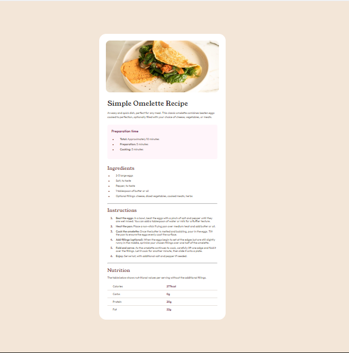
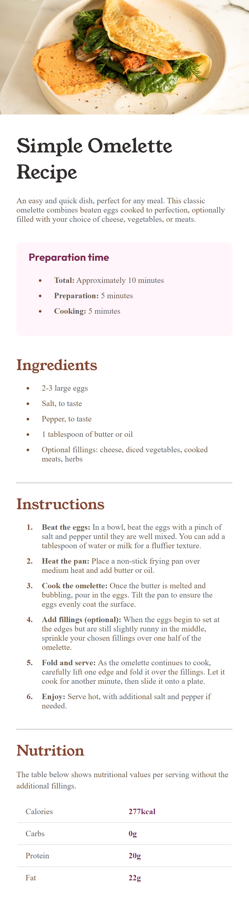

# Frontend Mentor - Recipe page solution

This is a solution to the [Recipe page challenge on Frontend Mentor](https://www.frontendmentor.io/challenges/recipe-page-KiTsR8QQKm). Frontend Mentor challenges help you improve your coding skills by building realistic projects. 

## Table of contents

- [Overview](#overview)
  - [The challenge](#the-challenge)
  - [Screenshot](#screenshot)
  - [Links](#links)
- [My process](#my-process)
  - [Built with](#built-with)
- [Author](#author)

## Overview

### Screenshot

Desktop

Mobile

### Links

- Solution URL: [(https://github.com/Y-ashbhatt/recipe-page-main)]
- Live Site URL: [(https://y-ashbhatt.github.io/recipe-page-main)]

## My process

### Built with

- Semantic HTML5 markup
- CSS custom properties
- CSS Grid
- Mobile-first workflow

## Author

- Frontend Mentor - [@Y-ashbhatt](https://www.frontendmentor.io/profile/Y-ashbhatt))
- Twitter - [@yash_bhatt01](https://x.com/yash_bhatt01)

